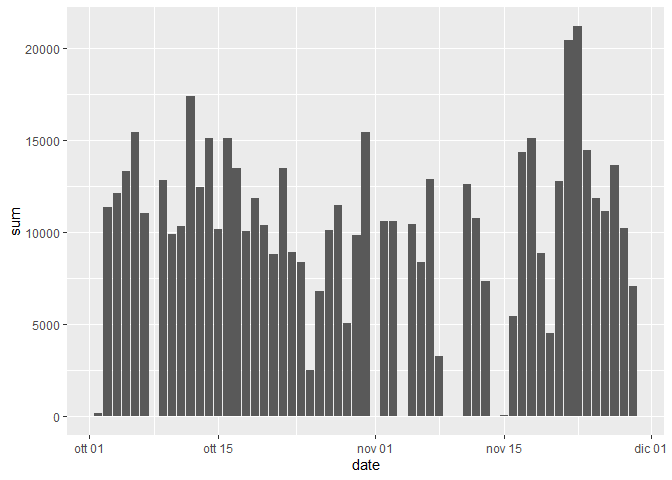
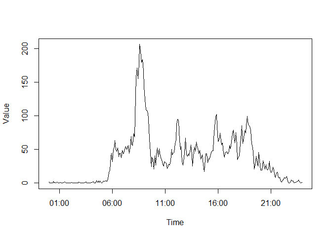
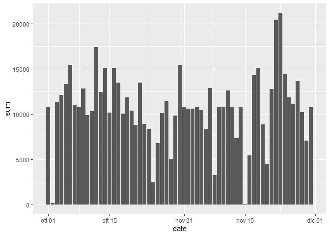
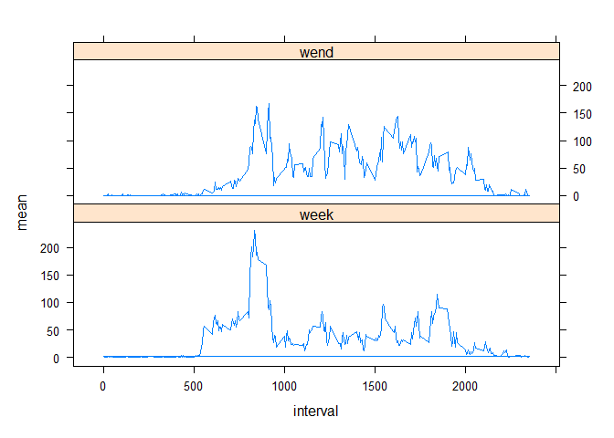

## Project 1


```r
library("lubridate")
library("lattice")
library("ggplot2")
library("dplyr")
library("forcats")
```

Load data and manipulate


```r
data <- read.csv("activity.csv")

data$handm <- paste(data$date, data$interval%/%100,data$interval%%100,sep = "-")
data$date <- ymd(data$date)
data$time <- strptime(data$handm, format="%Y-%m-%d-%H-%M")
```

## question 1


```r
activity <- data[!is.na(data$steps),]

act_per_day <-activity %>% group_by(date)%>% summarize(sum = sum(steps))
act_per_day <- na.omit(act_per_day)

ggplot(act_per_day, aes(date, sum)) +
  geom_col()
```



```r
mean(act_per_day$sum)
```

```
## [1] 10766.19
```

```r
median(act_per_day$sum)
```

```
## [1] 10765
```
## question 2


```r
act_per_min <- activity %>% group_by(interval)%>% summarize(mean = mean(steps))
act_per_min$handm <- paste(act_per_min$interval%/%100,act_per_min$interval%%100,sep = "-")
act_per_min$time <- as.POSIXct(act_per_min$handm, format="%H-%M")

plot(act_per_min$time,act_per_min$mean, type = "l", xlab = "Time", ylab = "Value")
```



Here is the maximum time:

```r
act_per_min[act_per_min$mean == max(act_per_min$mean),c(1,2,4)]
```

```
## # A tibble: 1 × 3
##   interval  mean time               
##      <int> <dbl> <dttm>             
## 1      835  206. 2023-01-18 08:35:00
```

## question 3


```r
dim(data)[1]-dim(activity)[1]
```

```
## [1] 2304
```

```r
activity_NAN <- left_join(data[is.na(data$steps),], act_per_min[,c("mean","interval")], by = "interval")
activity_NAN$steps <- activity_NAN$mean

data2 <- full_join(activity_NAN[,-6],activity[,-6])
```

```
## Joining, by = c("steps", "date", "interval", "handm", "time")
```

```r
act_per_day2 <- data2 %>% group_by(date)%>% summarize(sum = sum(steps))
ggplot(act_per_day2, aes(date, sum)) +
  geom_col()
```



```r
mean(act_per_day2$sum)
```

```
## [1] 10766.19
```

```r
median(act_per_day2$sum)
```

```
## [1] 10766.19
```
The mean and median obviously does not change because I have substituted the missing value by their mean.


### question 4


```r
data2$day <- weekdays(data2$time)
fattori <- factor(data2$day)
livelli <- levels(fattori)

data2$fattori <- fattori %>% fct_collapse(wend = livelli[c(1,6)], week = livelli[c(-1,-6)])
act_per_min2 <- data2[data2[,"fattori"] == levels(data2$fattori)[1],] %>% group_by(interval)%>% summarize(mean = mean(steps))
act_per_min3 <- data2[data2[,"fattori"] == levels(data2$fattori)[2],] %>% group_by(interval)%>% summarize(mean = mean(steps))
act_per_min2$fattori <- levels(data2$fattori)[1]
act_per_min3$fattori <- levels(data2$fattori)[2]
act_per_min_tot <- full_join(act_per_min2,act_per_min3)
```

```
## Joining, by = c("interval", "mean", "fattori")
```

```r
data22 <- left_join(data2[,-8],act_per_min_tot, by = c("fattori","interval"))


xyplot(mean ~ interval | fattori, data = data22, layout = c(1,2), type = "l")
```




